# Stroke_ML
Project_4_Group_1 : https://github.com/maproctor95/Stroke_ML

Presentation:https://www.canva.com/design/DAFeEYevC_E/qr58pjAJQq_8s5F0WTod9w/view?utm_content=DAFeEYevC_E&utm_campaign=designshare&utm_medium=link&utm_source=publishsharelink
## Overview of Project
* Data Model Implementation
    * Student produces an analytical model in Python that fulfills all the following specifications:
        * Script initializes, trains, and evaluates a model, or loads a pretrained model from hyperparameter tuning
        * Script cleans, normalizes, and standardizes input data prior to modeling
        * Model utilizes data retrieved from a relational database or big data source (SQL or Spark)
        * Model demonstrates meaningful predictive power (>75% classification accuracy, >80 R-squared)
        
* Data Model Optimization
    * Clear, well-documented evidence of model optimization and performance evaluation in the form of one of the following:
    * A CSV/Excel table showing model designs, testing parameters, and model performance
    * A Python script that utilizes hyperparameter tuning logic
    * Overall model performance is printed or displayed at the end of the script

* Project and Documentation Uploaded to Github
    * Successfully uploaded to GitHub; demonstrating professional quality of presentation
    * GitHub repository is free of unnecessary files and folders and has an appropriate .gitignore in use
    * The README is customized to a professional level
    
* Group Presentation 
    * All group members spoke during presentation
    * Group was well prepared
    * Presentation was relevant to material
    * Presentation maintains audience interest

* Slide Deck
    * Slides are visually clean and professional
    * Slides are relevant to material
    * Slides effectively demonstrate project
    * Slides are clear and maintain audience interest
    
### Purpose
   
* Predict likelihood of having a stroke based on their life circumstances (e.g., urban vs. rural location, history of smoking, type of job, pre-existing health conditions)

## Analysis

* Data Model Implementation
    * We used Kaggle data from : https://www.kaggle.com/datasets/fedesoriano/stroke-prediction-dataset 
    * Cleaning
        * Once we found the data we pulled the CSV and imported it into our jupyter notebook. During this time we cleaned the data by turning all the words into dummy numbers to better train the model. After adjusting the data we dropped all the null values in the dataset. Once our data was cleaned we created a testing model through the use of spliting and scaling the dataset to start the machine learning process.
    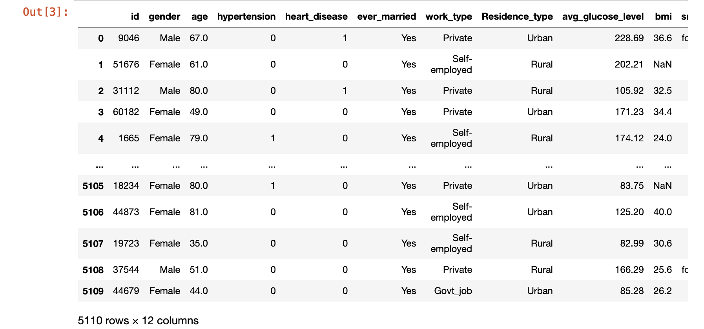
    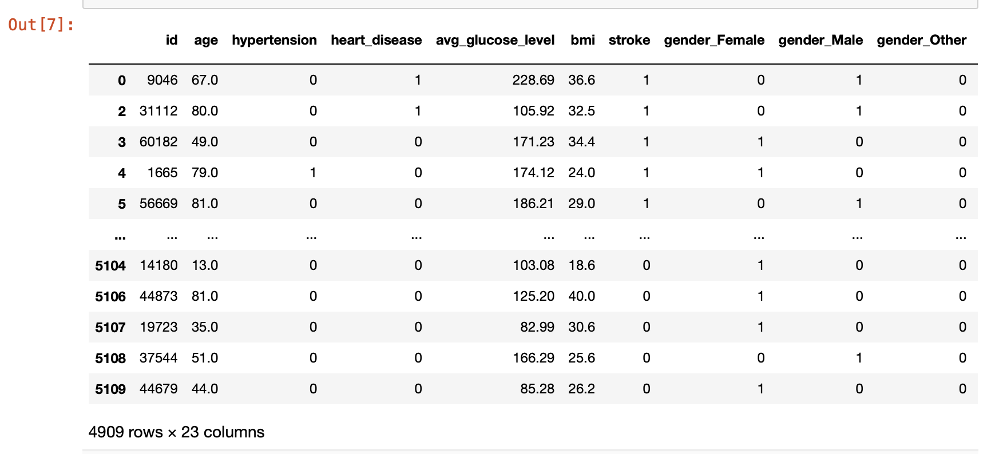
    * Creating a Database
        * We created a SQL database using PGAdmin. During the process we used the original data set and made a table and then imported the data into the created table. During the creation process we learned that some of the data was very interesting, for example there were decimals in the age column as well as very young ages within the dataset that we did not expect.
    
    * Visualizing
        * To visualize the data we decided to use Tableau. While creating the graphs we were able to see some interesting data points. In one of the graphs we binned the Age column and compared it to the Ever Married Column. We found that majority of the dataset that were ever married suffered from a stroke compared to those who were not. It sparked a question on whether stress could possibly be a factor on those who've had a stroke. We also compared the smoking status between genders and who were more likely to have a stroke. The data shows that more women who have never smoked are more than likely to have a stroke more than a men were former smokers. I believe it can conclude that nicotine doesnt play a factor on the likely hood to have a stroke. However, in another graph we compared the heart disease column to the gender column and their smoking status. More men are likely to have heart disease that either never smoked or were former smokers compared to women.
        * Age vs Glucose Levels
        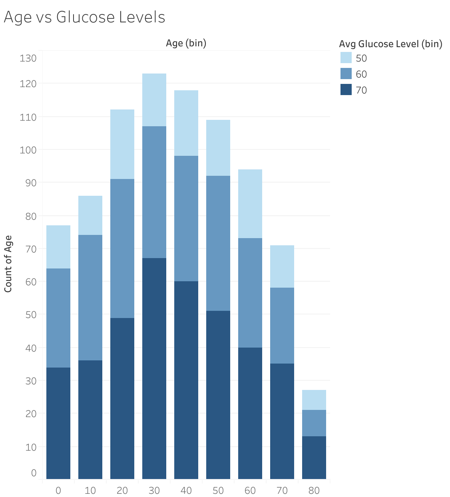
        * Heart vs Gender Smoking Status
        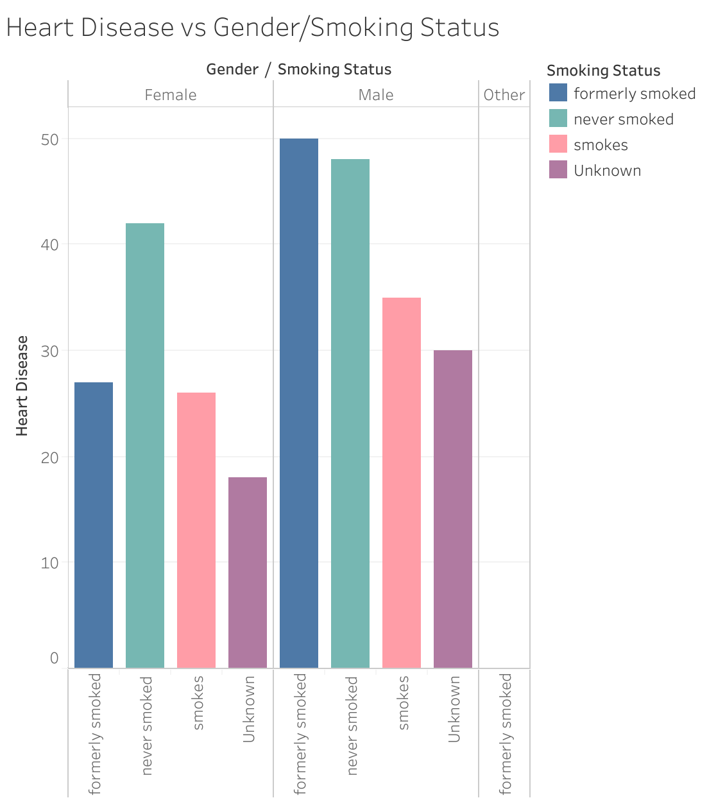
        * Stroke vs Smoking Status
        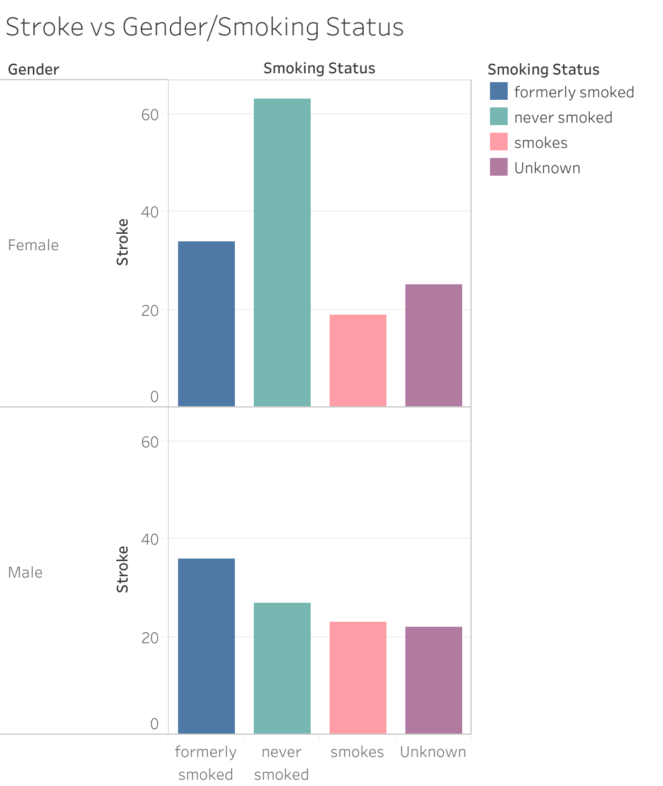
        * Stroke Marriage
        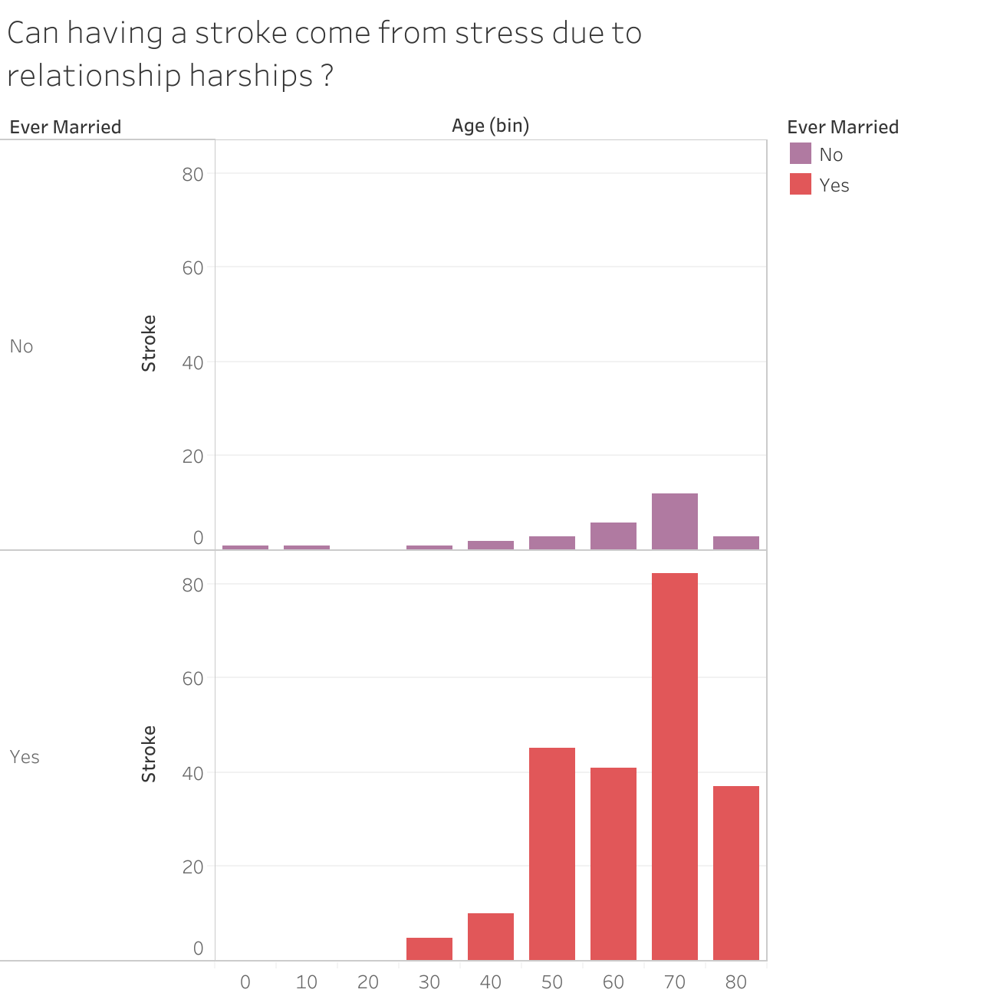
        * Strokes vs Work Types
        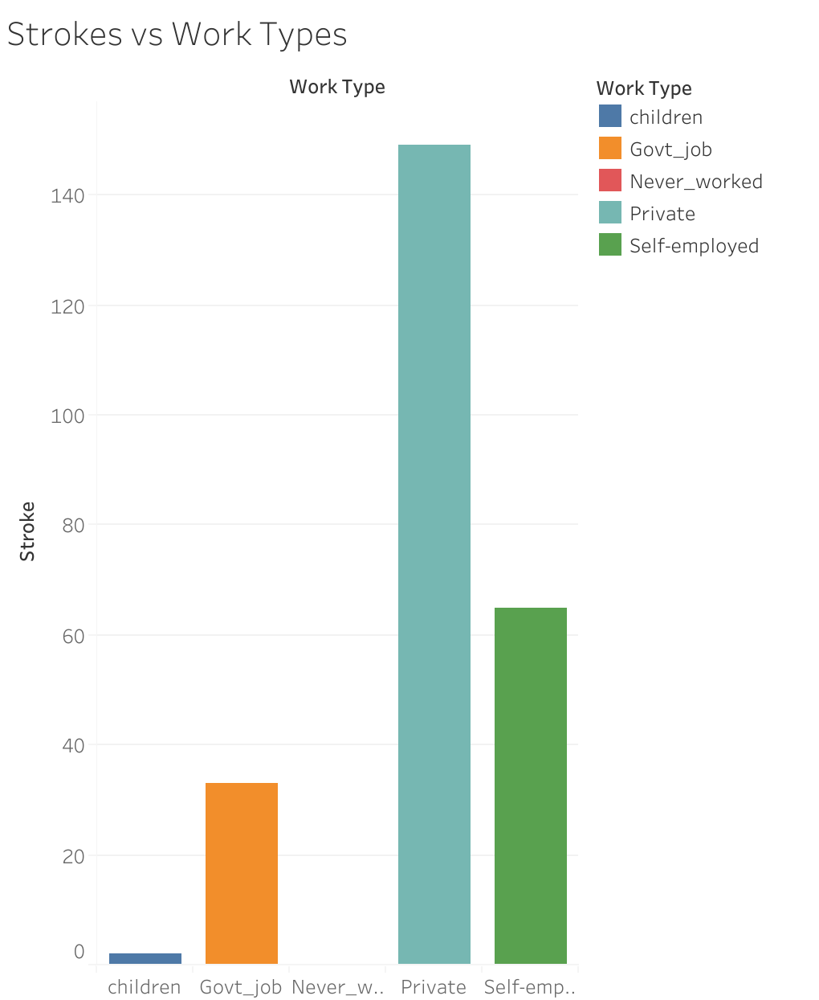

* Data Model Optimization
    * Random Forest Classifier
    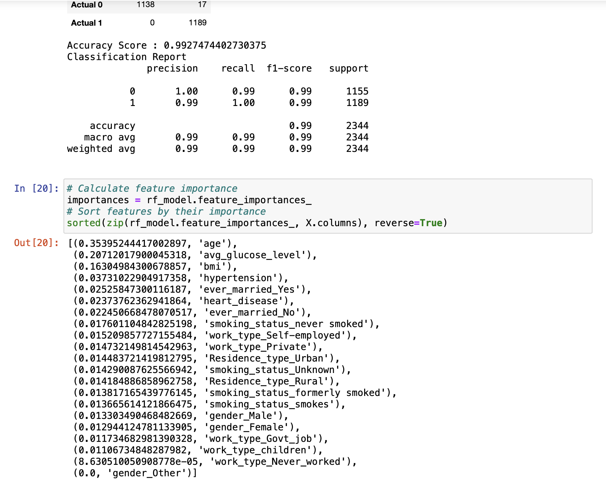
    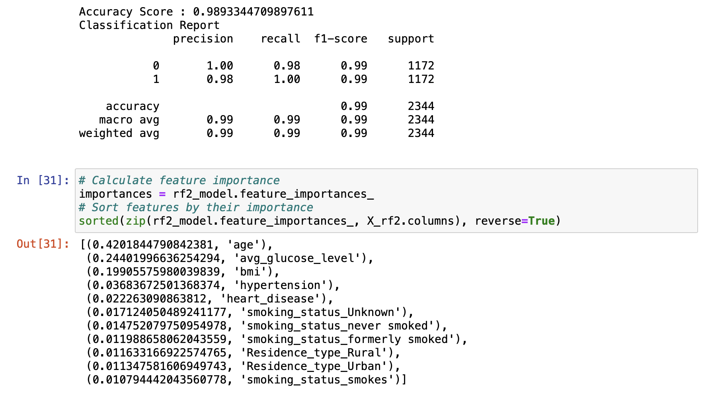
    * Logistic Regression
    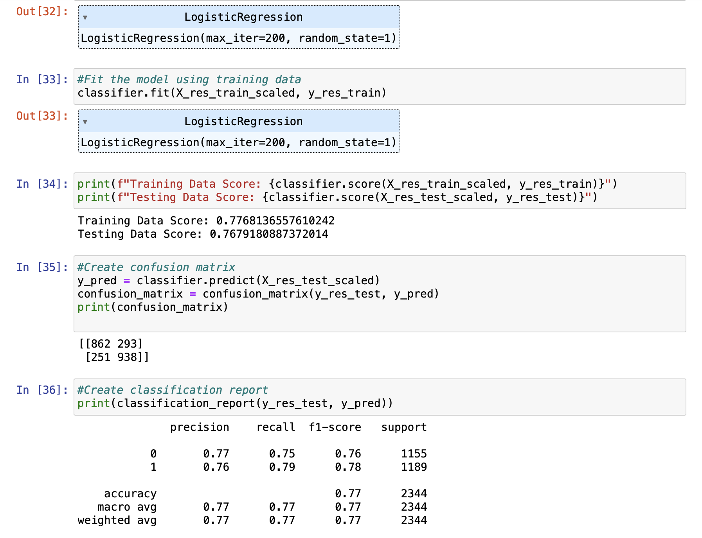
    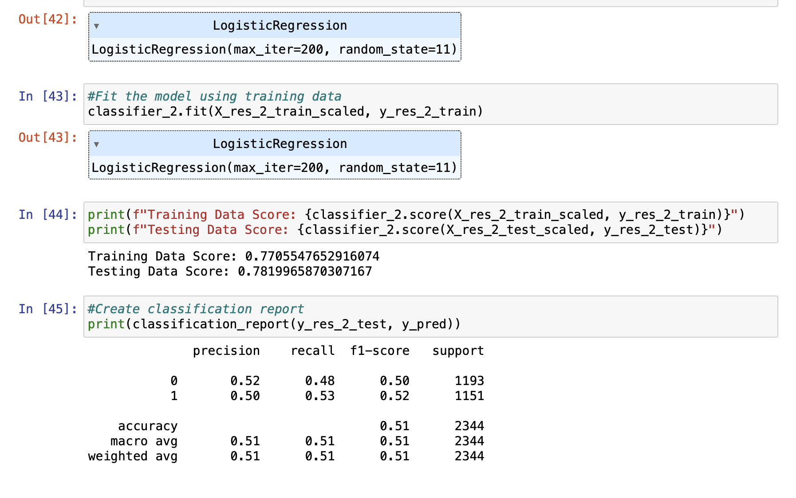
    
    * K Neighborhood Classifier
    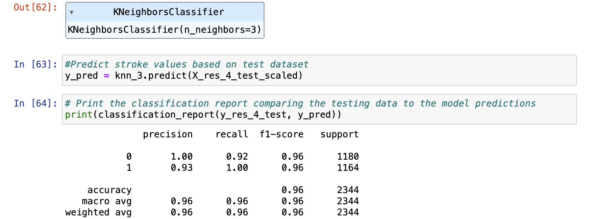
    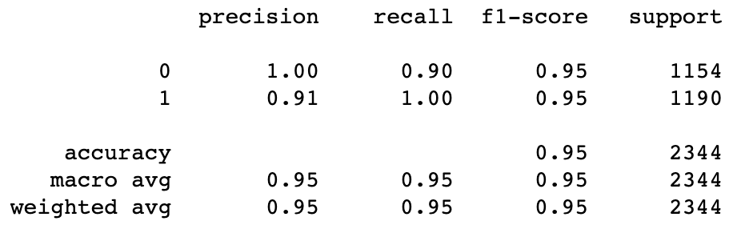
    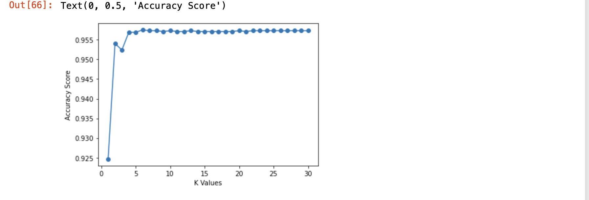
